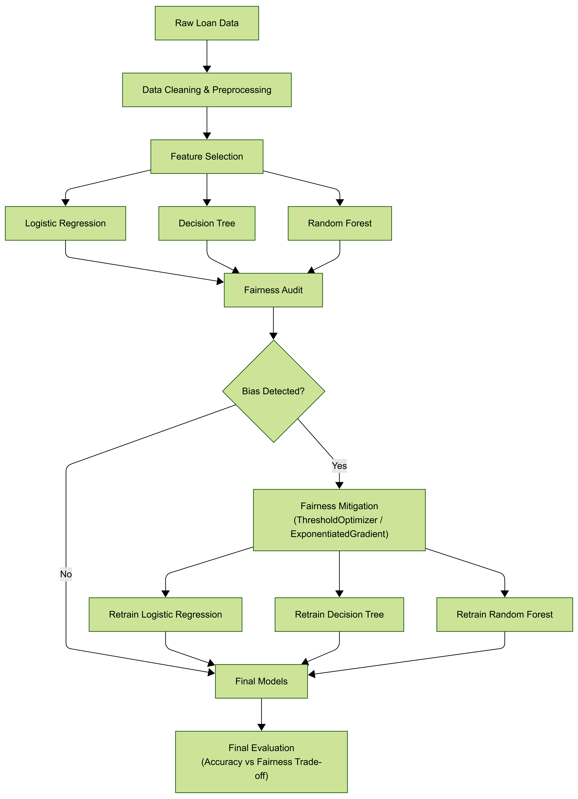

# Fairness-Aware Loan Approval

> *Detecting and mitigating demographic bias in Indian bank loan decisions using CIBIL data and Fairlearn.*

---

## Table of Contents
1. [Project Overview](#project-overview)
2. [Flowchart](#flowchart)
3. [Dataset Description](#dataset-description)
4. [Fairness Objective](#fairness-objective)
5. [Folder Structure](#folder-structure)
6. [Pipeline Workflow](#pipeline-workflow)
7. [References](#references)

---

## Project Overview

This project investigates algorithmic fairness in automated loan approval systems used by a Leading Indian Bank. Using applicant credit profiles derived from the CIBIL (Credit Information Bureau India Limited) dataset, we:

- Build three baseline classifiers (Logistic Regression, Decision Tree, Random Forest).
- Audit each model for bias across protected demographic attributes (gender, age group, caste category, region).
- Apply Fairlearn-based mitigation strategies (ThresholdOptimizer, ExponentiatedGradient) to reduce unfair disparities without sacrificing model utility.

The project is structured for clean collaboration between **3 contributors** and follows reproducible ML engineering practices.

---
## Flowchart

## Dataset Description

| Attribute | Details |
|---|---|
| **Source** | Leading Indian Bank & CIBIL dataset |
| **Task** | Binary classification — loan approved (1) / rejected (0) |
| **Key Features** | Credit score, loan amount, income, employment type, repayment history, LTV ratio, bureau enquiries, etc. |
| **Protected Attributes** | Gender, Age Group, Caste Category, Region |
| **Format** | CSV / Excel |

---

## Fairness Objective

Automated credit scoring can perpetuate or amplify historical societal inequities. Our goals are to:

1. **Measure** demographic disparity using Fairlearn's `MetricFrame` — selection rate, TPR, FPR, Demographic Parity Difference, and Equalized Odds Difference.
2. **Mitigate** identified disparities using two complementary approaches:
   - **Post-processing** — `ThresholdOptimizer` with a Demographic Parity constraint.
   - **In-processing** — `ExponentiatedGradient` with a Demographic Parity constraint.
3. **Report** the accuracy–fairness trade-off for each technique and each protected attribute.

---

## Folder Structure

```
fairness-aware-loan-approval/
│
├── data/
│   ├── raw/                    ← Place your dataset here (git-ignored)
│   └── processed/              ← Cleaned & feature-selected CSVs (git-ignored)
│
├── notebooks/
│   └── 01_data_exploration.ipynb   ← EDA, distributions, correlation analysis
│
├── src/
│   ├── data_processing/
│   │   ├── clean_data.py           ← Deduplication, imputation, encoding
│   │   └── feature_selection.py    ← Variance, correlation, SelectKBest
│   ├── modeling/
│   │   └── train_baseline_models.py← LR, DT, RF training & evaluation
│   └── fairness/
│       ├── fairness_audit.py       ← MetricFrame bias audit
│       └── fairness_mitigation.py  ← ThresholdOptimizer & ExpGradient
│
├── models/                     ← Serialised .joblib model files
├── results/                    ← Metrics CSVs, fairness plots
├── report/                     ← Final project report (PDF / DOCX)
├── tests/                      ← Unit tests (pytest)
│
├── .gitignore
├── requirements.txt
└── README.md
```

---

## Pipeline Workflow

```
data/raw/loan_data.csv
        │
        ▼
src/data_processing/clean_data.py
   → data/processed/cleaned_data.csv
        │
        ▼
src/data_processing/feature_selection.py
   → data/processed/features.csv
        │
        ▼
src/modeling/train_baseline_models.py
   → models/*.joblib
   → results/baseline_metrics.csv
        │
        ▼
src/fairness/fairness_audit.py
   → results/fairness_audit_report.csv
   → results/fairness_<model>_<attribute>.png
        │
        ▼
src/fairness/fairness_mitigation.py
   → models/threshold_optimizer_<attr>.joblib
   → models/exponentiated_gradient_<attr>.joblib
   → results/mitigation_comparison.csv
```

---

## References

- Fairlearn documentation: https://fairlearn.org
- CIBIL: https://www.cibil.com
- Bird et al. (2020). *Fairlearn: A toolkit for assessing and improving fairness in AI*. Microsoft Research.
- Hardt, Price & Srebro (2016). *Equality of Opportunity in Supervised Learning*. NeurIPS.


